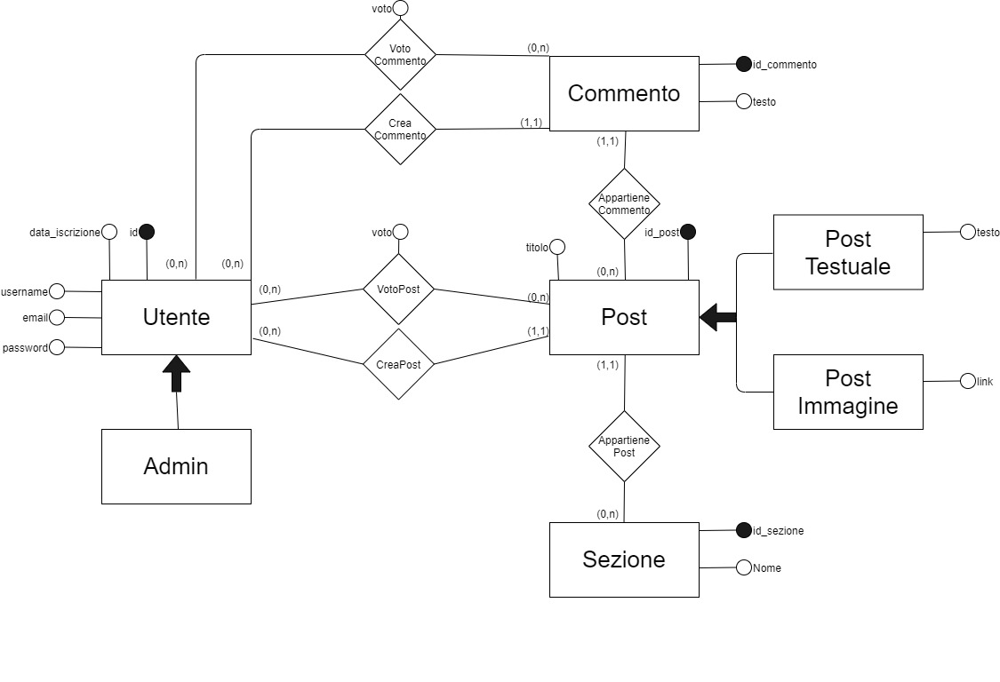
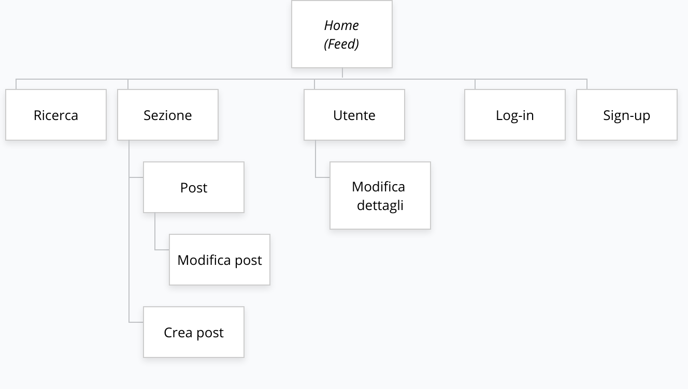
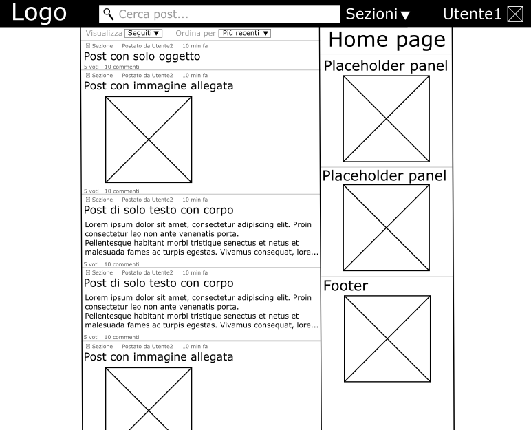
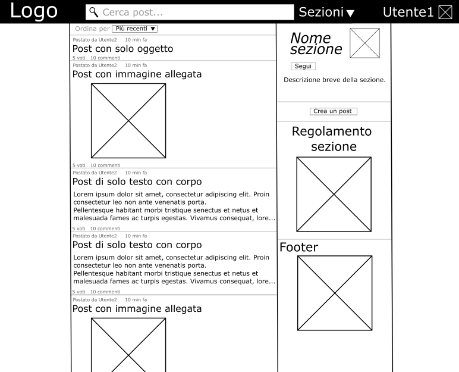
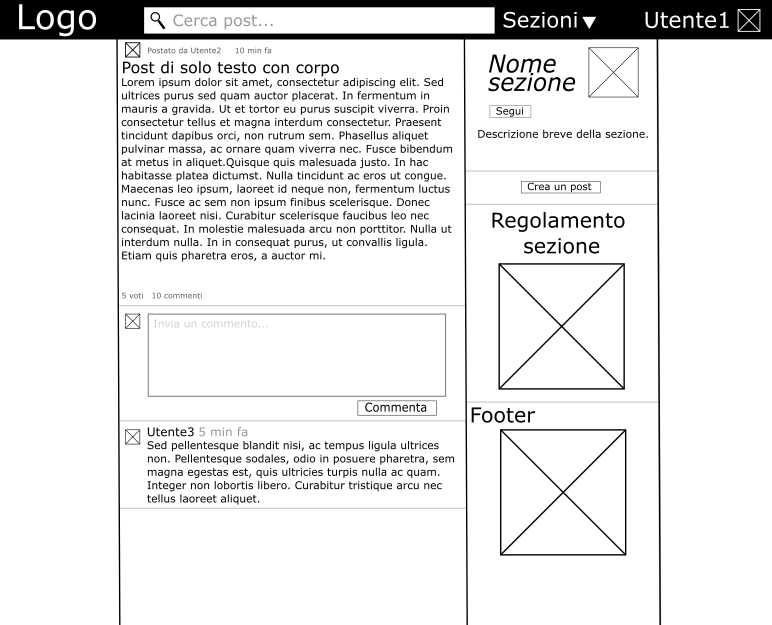
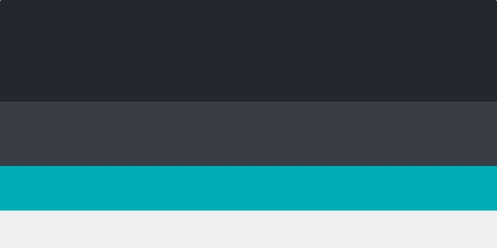

# Shareboard 

ShareBoard intende diventare un social media atto a promuovere lo scambio di idee e di informazioni tra persone che condividono gli stessi interessi. ShareBoard funge da &quot;aggregatore di contenuti&quot; mantenuto da utenti che collaborano condividendo post o interagendo con essi. L&#39;obiettivo è quello di offrire un punto di riferimento per chiunque volesse condividere il proprio lavoro, una propria idea in rete o anche per interagire e stare in contatto con utenti con un certo interesse in comune.

## Funzionalità del sito

**Funzionalità lato guest**

L&#39;utente non registrato (guest) avrà la possibilità di:

- Visualizzare post e i commenti
- Registrarsi o accedere
- Ricercare post nel sito per titolo o contenuto
- Visualizzare il profilo di uno specifico utente
- Include una biografia dell&#39;utente e la sua cronologia dei messaggi/commenti
- Seguire (_follow_) o smettere di seguire una sezione di suo interesse
- Occorre registrarsi per mantenere le sezioni seguite in modo permanente
- Le sezioni seguite saranno visualizzate nella homepage in una sezione apposita

**Funzionalità lato utente registrato**

L&#39;utente registrato può fare tutto quello che può fare un utente guest, con l&#39;aggiunta di:

- Scrivere post
- Commentare post
- Modificare i propri post o commenti
- Votare un post o un commento
- Modificare i dettagli del proprio profilo (e-mail, password, biografia, avatar)

**Funzionalità lato amministrativo**

L&#39;amministratore può effettuare tutte le operazioni concesse ad un utente ordinario registrato, con l&#39;aggiunta di:

- Aggiungere e rimuovere sezioni
- Gestione sezioni
- Modifica attributi quali la descrizione
- Moderare i post e i commenti
- Rimuovendoli o modificandoli
- Sospendere un utente dall&#39;utilizzo della piattaforma o di una sezione specifica
- Permanentemente o per un lasso di tempo definito
- Visualizzare e modificare informazioni degli utenti
- Include anche informazioni non accessibili a tutti gli utenti (indirizzo e-mail)

## Contenuti

I contenuti principali di ShareBoard sono i **post** , questi vengono caricati dagli utenti e sono composti da un titolo (o _oggetto_) a cui è possibile aggiungere una descrizione testuale o un&#39;immagine. I post possono essere a loro volta commentati e sono divisi in sezioni in base alla tematica.

Ogni **post** è caratterizzato quindi da:

- Titolo (o oggetto)
- (Opzionale) Immagine o corpo del messaggio
- Numero complessivo dei voti (_voti positivi – voti negativi)_
- Sezione
- Autore del post
- Commenti
  - Ogni commento può essere votato in maniera analoga ai post

I post possono essere cercati per tutto il sito usando l&#39;apposita funzione _cerca._

Il sito è suddiviso in **sezioni**. Ogni sezione rappresenta una determinata area di interesse (ad esempio Arte, Musica o Videogiochi) e consente una suddivisione dei post in macrocategorie. Ogni sezione è caratterizzata da

- Insieme dei post inviati
  - Possono essere visionati in ordine di invio, in ordine di popolarità…
- Nome
- Logo
- Breve descrizione
- Regolamento della sezione

Ogni post ha come autore un **utente registrato**. Un utente registrato ha i seguenti attributi visibili:

- Nome utente
- Biografia
- Immagine del profilo
- Cronologia dei post inviati nel sito

## DB Schema

## Sitemap

## Layout
### Home Page

La _top level navigation_ è consentita dalla navbar fissata in alto.

La sezione centrale costituisce la sezione principale e mostra i post delle sezioni seguite oppure, in alternativa, i post in tendenza tra tutte le sezioni del sito. È possibile ordinare i post per popolarità (numero di voti) o per data di invio. Lo scorrimento dei post è infinito, pertanto è stato posizionato il footer nel menù laterale.

Il menù laterale fornisce informazioni riguardanti l&#39;intero sito. Lo scopo del menù laterale è diverso per quanto riguarda le singole sezioni, dove sono invece mostrate informazioni riguardanti la sezione stessa.

### Sezione

### Post

### Color palette

